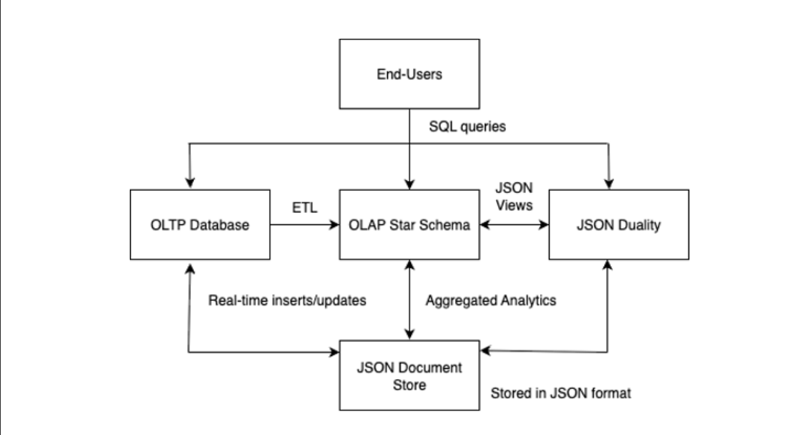
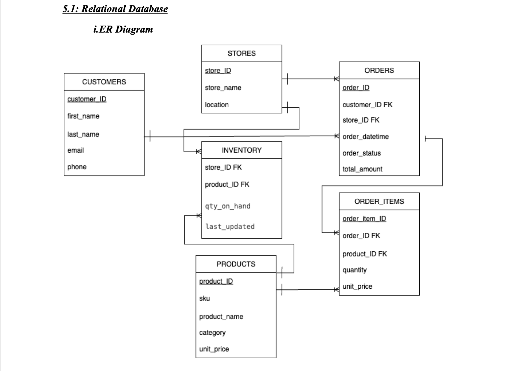
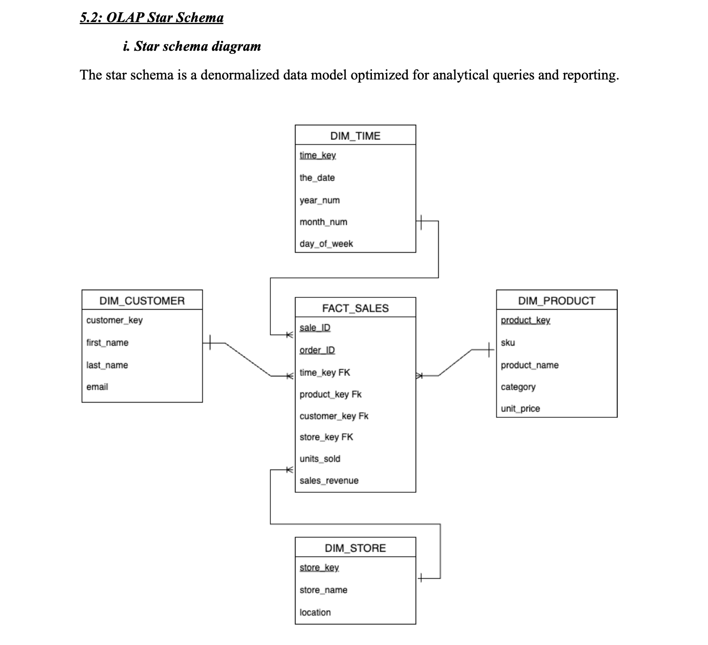
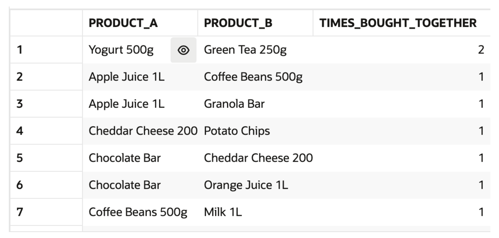
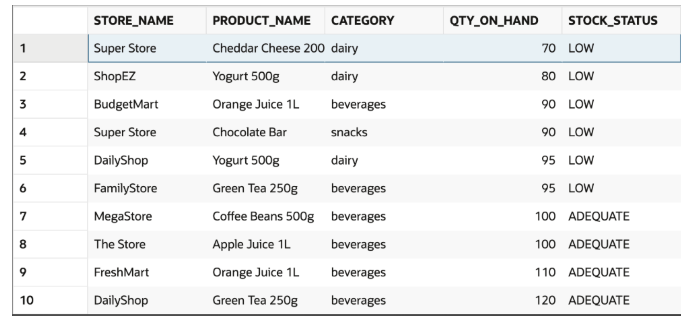
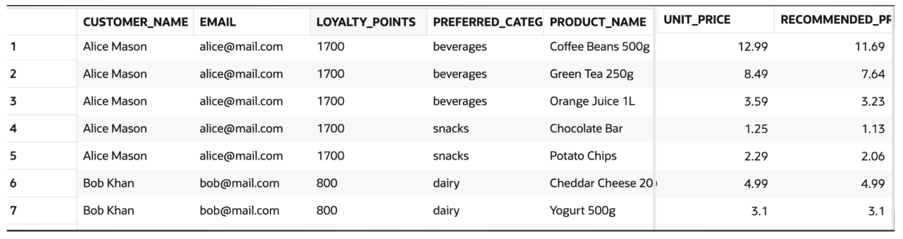

# Smart Retail Analytics Hub

## Overview
A retail analytics and decision-support system designed to connect day-to-day transactional data with historical analysis and business intelligence.

The project integrates relational OLTP data, an OLAP star schema, and JSON-based customer data to support sales reporting, inventory monitoring, customer analysis, and future AI/BI applications.

## Business Problem
Retail businesses need to manage real-time operations while also analyzing historical performance across customers, products, stores, and inventory.

This project was designed to answer questions such as:

- Which stores and product categories generate the most revenue?
- Which products are at risk of running out of stock?
- Who are the highest-value customers?
- Which products are frequently purchased together?
- How can customer preferences support personalized recommendations?

## Tools & Technologies
- Oracle SQL
- Oracle Live SQL
- OLTP / Relational Modeling
- OLAP / Star Schema
- JSON
- Data Warehousing
- Business Analytics

## Data Architecture
The system includes three integrated layers:

### OLTP
Normalized transactional tables for:
- Customers
- Products
- Stores
- Inventory
- Orders
- Order Items

### OLAP
A star schema centered on `Fact_Sales` with:
- `Dim_Product`
- `Dim_Customer`
- `Dim_Store`
- `Dim_Time`

### JSON
Semi-structured customer profiles and order data used to support flexible customer attributes, preferences, and personalized analytics.

## Business Analytics Use Cases
The project explored business analytics use cases including:

- Daily revenue and average order value monitoring
- Inventory status and low-stock alerts
- Store and category performance comparison
- Customer lifetime value segmentation
- Top-customer identification
- Frequently bought-together analysis
- Cross-selling opportunities
- Personalized product recommendations
- Demand and inventory risk monitoring

## Key Outcomes
- Built an integrated retail data model supporting both operational and analytical workloads.
- Transformed transactional data into a star schema for faster business reporting and aggregation.
- Used SQL and JSON logic to identify inventory risks, high-value customers, and cross-selling opportunities.
- Designed the system to support future Tableau/Power BI dashboards, forecasting, and AI-driven recommendations.

## System Design

### High-Level Architecture

### OLTP ER Diagram

### OLAP Star Schema

## Business Analytics Examples

### Cross-Selling Analysis

The basket analysis identified frequently purchased product pairs, supporting bundle offers, product placement, and recommendation opportunities.

### Inventory Alerts

Inventory monitoring classified stock levels to help identify products requiring replenishment and reduce stockout risk.

### Personalized Recommendations

Customer preferences and loyalty data stored in JSON were used to generate category-based product recommendations and loyalty-adjusted pricing.

## Project Files

- [Final Report](report/smart-retail-analytics-hub-report.pdf)
- [OLTP Schema](sql/01_oltp_schema.sql)
- [OLAP Star Schema – Portfolio Reconstruction](sql/02_olap_star_schema.sql)
- [Business Analytics Queries](sql/03_business_analytics.sql)
- [JSON Analytics & Personalization](sql/04_json_analytics.sql)
